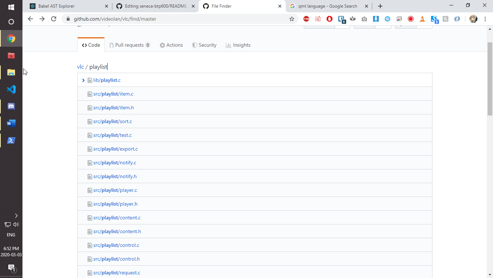
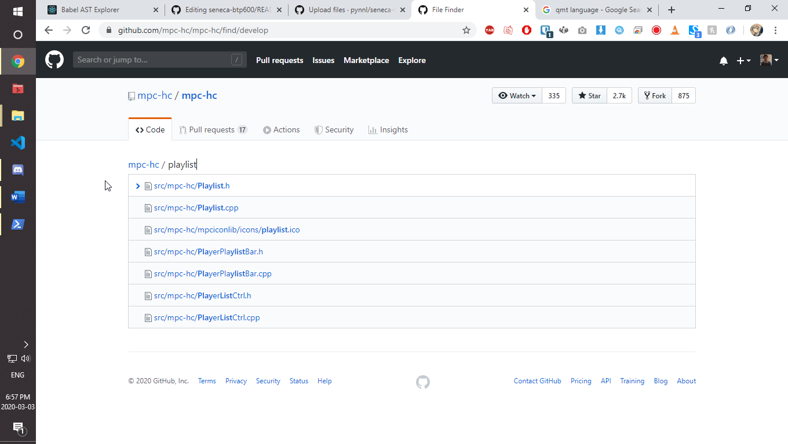
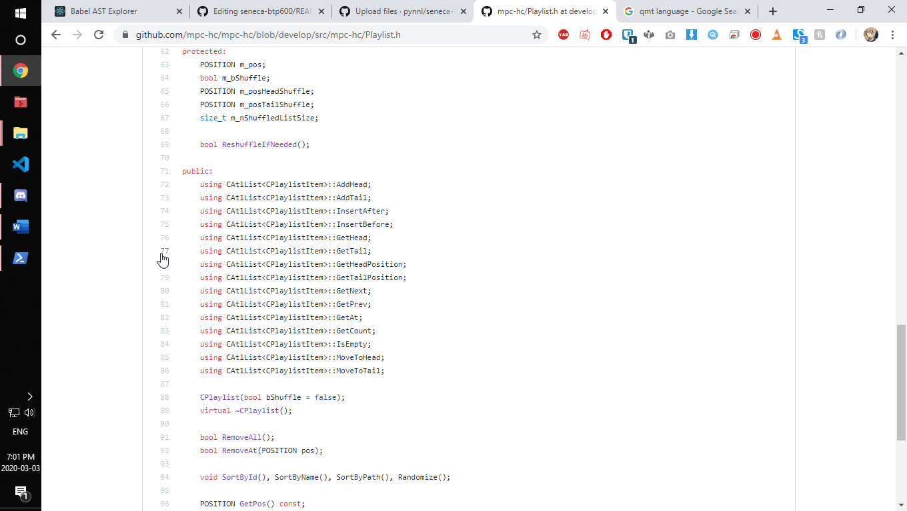
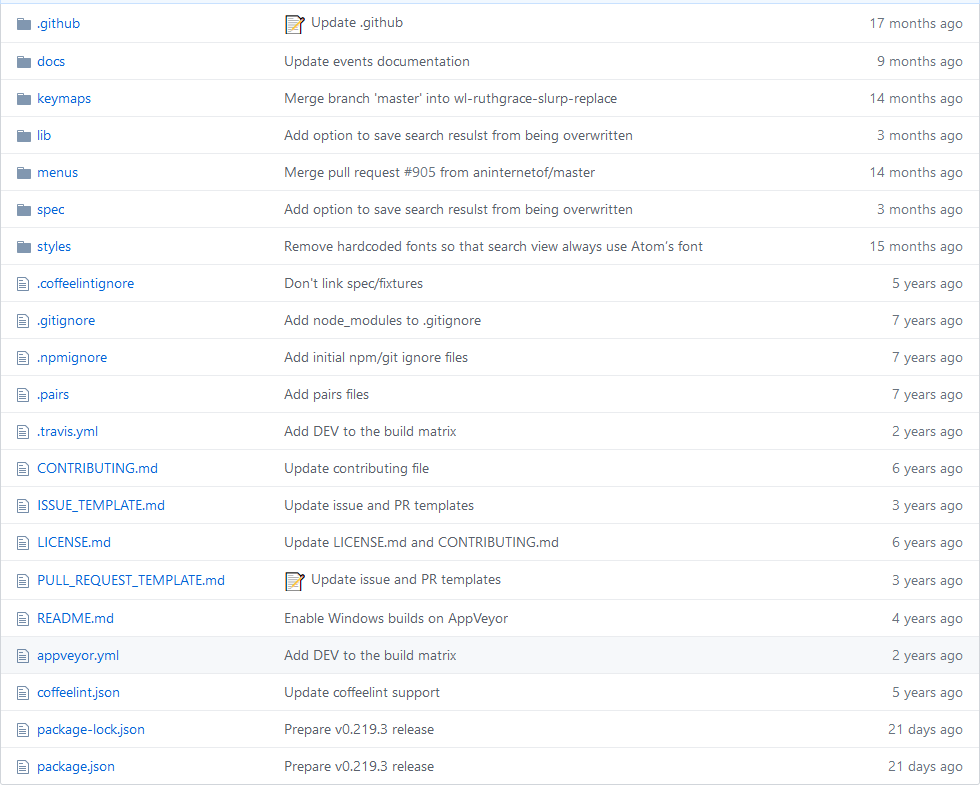
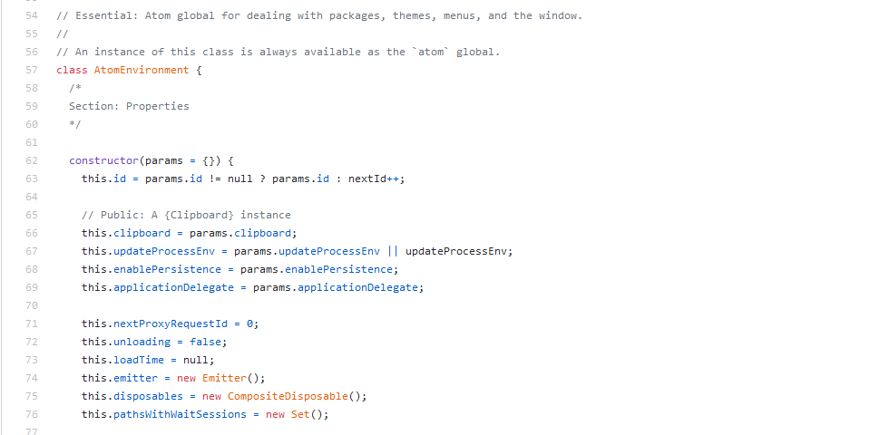
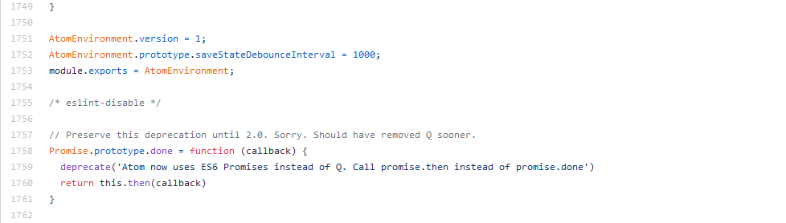

# Seneca-btp600 Group Project Proposal
Data Design Pattern

Projects:
  - [VLC Media Player](https://github.com/videolan/vlc)
  - [MPC Media Player](https://github.com/mpc-hc/mpc-hc)
  - [Atom IDE](https://github.com/atom/atom)
  
## VLC
VLC is a popular open-source media player. It is written mostly in C. The components are broken down into smaller components, which is very similar to how modern web development works. For example, the `playlist` is broken down into several pieces:

## MPC
MPC is another popular media player written in C++. Because it uses a high level languages, it can take use of several prebuilt features, leading to smaller codes. For example, for the same `playlist` features, MPC only needs couples of models:

Inside `playlist.h`, it uses `CAtlList` which is a built-in library in ATL for Visual Studio. More info here: https://docs.microsoft.com/en-us/cpp/atl/reference/catllist-class?view=vs-2019

## Atom
Atom has been designed as an extremely modular program which can add extra functionalities through the use of packages. Atom's core actually contains very little, and unlike other IDEs is missing even simple functionalities like syntax highlighting without the use of packages. Atom has a very specific file structure that will be the same for all of its packages. Here is an example with the find and replace functionality package: 

We found that the way that Atom manages its multitude of packages is through its API which is implemented using a singleton design pattern. It has a global variable called AtomEnvironment and this variable can be accessed by all of Atom's packages to allow for calls to Atom's API. Here is the code where Atom creates the instance of AtomEnvironment:

We chose to do our research project on Atom because it has very extensive documentation and JavaScript being a language that is very easy to read. It also uses very modern design practices and has an interesting structure with the way that Atom API works which made us want to learn more about Atom.

## Research Question:
What design patterns do the Atom API use and how does it make it easier to manage packages?

## Timeline
  - Week 1 (March 3)
    - Research external modules
  - Week 2 (March 10)
    - Research API internally (how API handles external modules)
  - Week 3 (March 17)
    - Finish written report
  - Week 4 (March 24)
    - Presentation preparation
  - Due Date March 31

